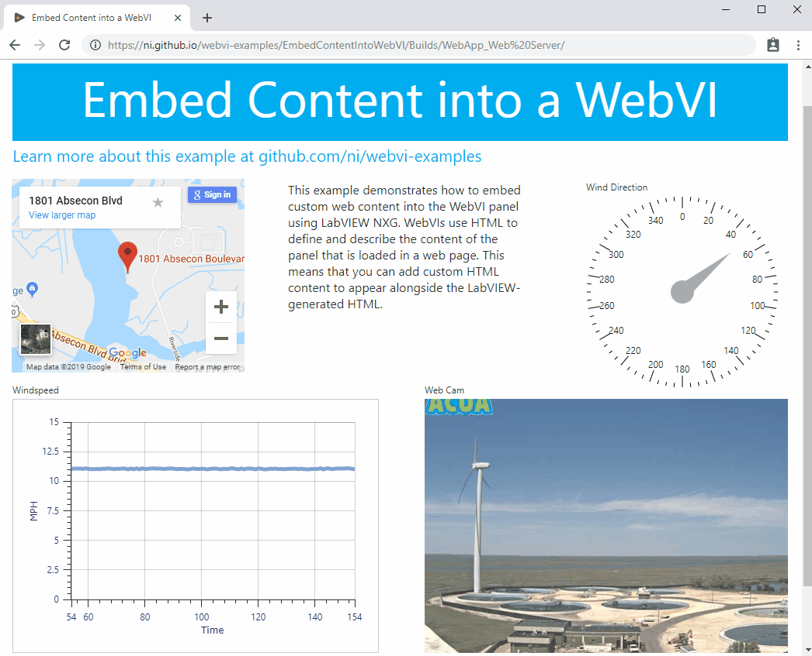

# Embed Content into a WebVI
[](https://ni.github.io/webvi-examples/EmbedContentIntoWebVI/Builds/WebApp_Web%20Server/Main.html)
[]()

This example demonstrates how to embed custom web content into the WebVI panel using LabVIEW NXG. WebVIs use HTML to define and describe the content of the panel that is loaded in a web page. This means that you can add custom HTML content to appear alongside the LabVIEW-generated HTML.



# Dependencies
- LabVIEW NXG Web Module

# Setup
1. Clone the [ni/webvi-examples](https://github.com/ni/webvi-examples) repository to your machine.
2. Open `EmbedWebVIIntoContent/WebVI/Embed WebVI into Content.lvproject`.
3. On the **Project Files** tab, expand `WebApp.gcomp` and open `Main.gviweb`.
4. Click the **Run** button.
5. Build the web application.  
  a. On the **Project Files** tab, double-click `WebApp.gcomp` to open the web application component.  
  b. On the **Document** tab, click **Build**.  

# Hosting
You can manually the move the build output found at `\EmbedWebVIIntoContent\Builds` to any web server. This project also includes a Distribution (WebApp.lvdist) that can be used to build a package (.nipkg). Packages utilize NI Package Manager to automate the process of installing, upgrading, or removing the web app. A package is also a requirement for hosting a Web application on SystemLink Cloud.

## SystemLink Cloud Web App Hosting
The following steps can be used to host the web app on SystemLink Cloud
1. Open `EmbedWebVIIntoContent.lvproject`.
2. Open `WebApp.lvdist`.
3. Click the build icon in the top command bar of this distribution document
4. Open a Web browser and navigate to https://www.systemlinkcloud.com/webapphosting
5. Click the **Choose nipkg** button and select the nipkg built in step 3.
6. When the upload is complete, click on your newly uploaded Web app from your list of Web apps

## Local Hosting
The following steps can be used to host the web app on a local web server
### Hosting on the NI Web Server with a nipkg
1. Open `EmbedWebVIIntoContent.lvproject`
2. Open `WebApp.lvdist`.
3. Click the build icon in the top command bar of this distribution document
4. Double-click the nipkg and follow the on screen instructions
5. Open a web browser and navigate to `http://localhost:9090/embedcontentintowebvi/Main.html`

### Hosting on the LabVIEW 2009-2017 Web Server
1. Open `C:\Program Files (x86)\National Instruments\Shared\NI WebServer\www`.
2. Copy the `WebApp+Web Server` directory into the `www` directory.
3. Open a web browser and navigate to `http://localhost:8080/WebApp_Web%20Server/Main.html`

### Hosting on the NI Web Server
1. Open `C:\Program Files\National Instruments\Shared\Web Server\htdocs`.
2. Copy the `WebApp_Web Server` directory into the `htdocs` directory.
3. Open a web browser and navigate to `http://localhost:9090/WebApp_Web%20Server/Main.html`.

**Note:** To view the build output on your machine, click **Locate Directory in Windows Explorer** on the **Document** tab once your application finishes building. You can automatically launch and view the Web application locally by going to **System Designer** >> **Web Server** >> right-click **WebApp.gcomp** >> **Run**

# Details
This section describes the content added to the HTML source of the WebVI to create a web page that shows current weather conditions for Iowa State University. The HTML source can be edited by clicking the `Edit panel HTML` button in the WebVI panel's toolbar.

## Custom iframes
This example uses an `<iframe>` generated from [Google Maps](https://developers.google.com/maps/documentation/embed/guide) was added to show the location of the web cam on a map.
```html
<div>
  <iframe id="map" src="https://www.google.com/maps/embed?pb=!1m18!1m12!1m3!1d3083.9251931399904!2d-74.4527296846353!3d39.380569979499064!2m3!1f0!2f0!3f0!3m2!1i1024!2i768!4f13.1!3m3!1m2!1s0x89c0efaacf825f6f%3A0x6d8892ab37e17426!2s1801+Absecon+Blvd%2C+Atlantic+City%2C+NJ+08401!5e0!3m2!1sen!2sus!4v1502732532752 "width="300" height="250" frameborder="0" style="border:0" allowfullscreen=""></iframe>
</div>
```

## URL Image
The **URL Image** indicator from the **Drawings** palette category allows you to enter a URL to an external image. The **URL Image** supports both static images (`.jpg`, `.png`, etc.) and animated images (`.gif`, etc.).

This example uses the following image URL from the [Atlantic County Utilities Authority](http://www.acua.com/green-initiatives/renewable-energy/windfarm/): `http://107.1.228.34/axis-cgi/mjpg/video.cgi?resolution=640x480&compression=50&dummy=1502732035434`
