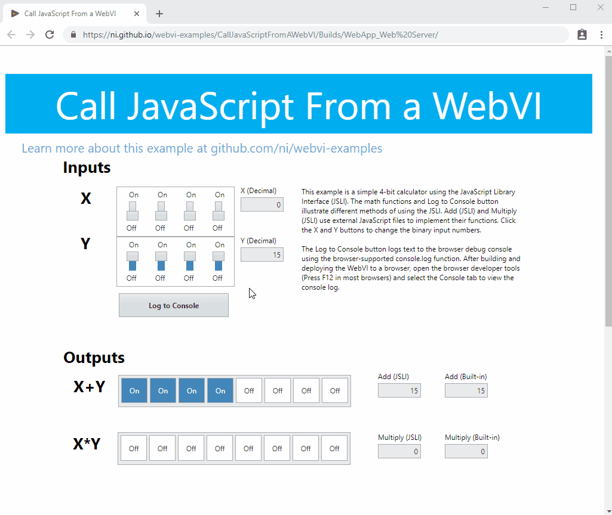
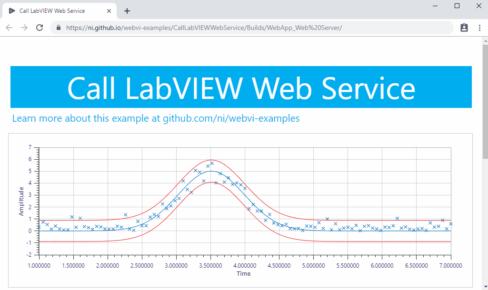
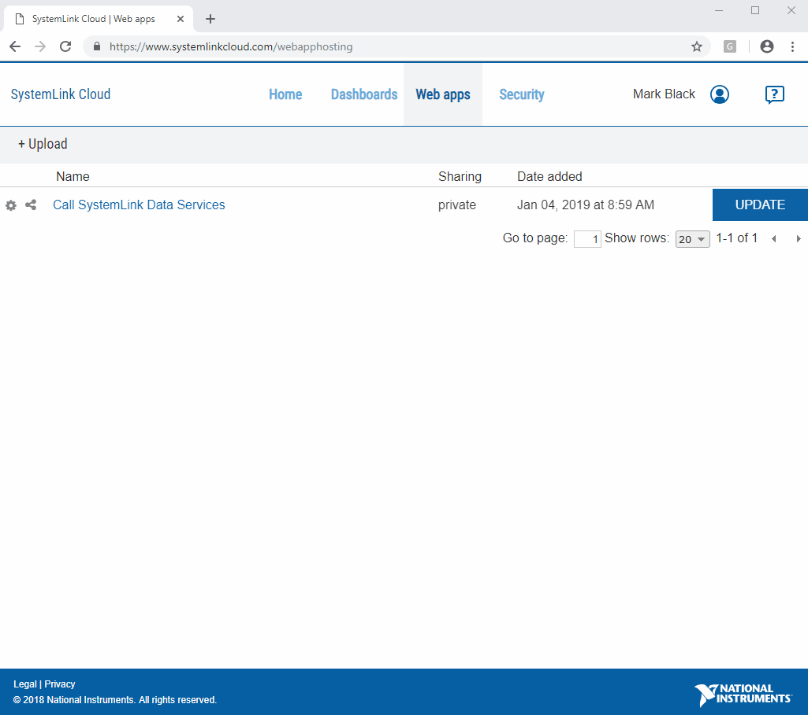
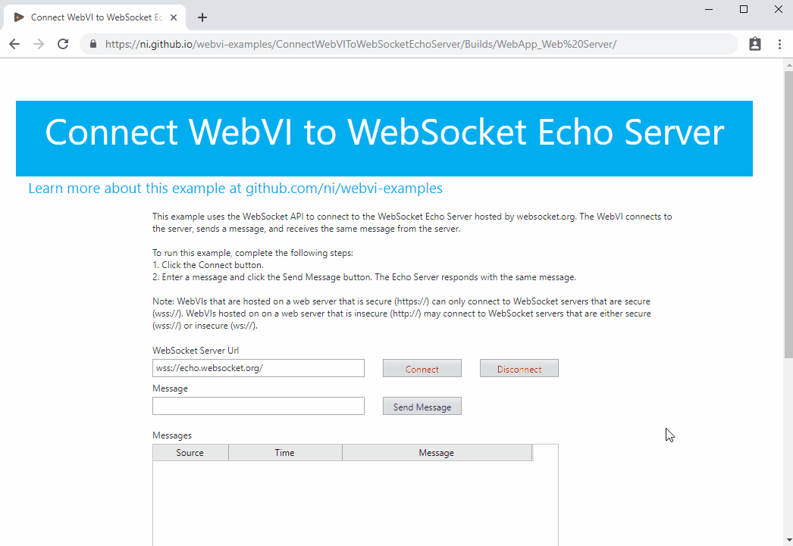
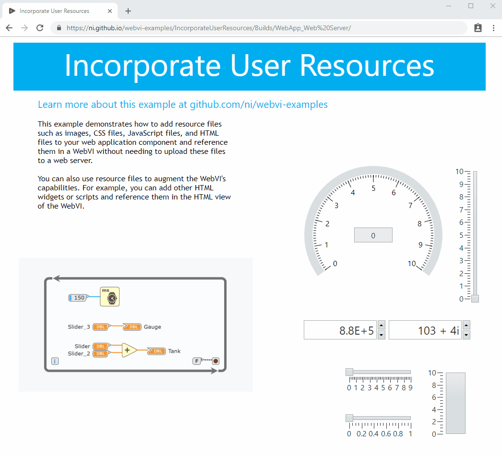
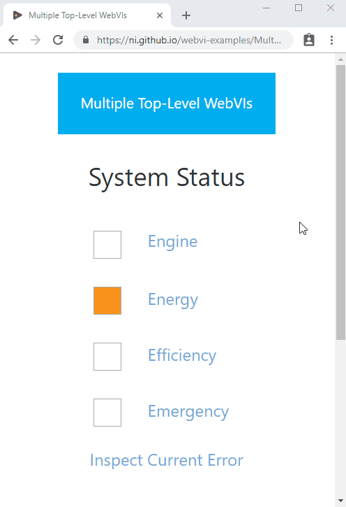

# WebVI Examples for LabVIEW NXG Web Module

This repository has examples for:
**LabVIEW NXG 5.0 Web Module**

For previous LabVIEW NXG versions see the [previous releases](https://github.com/ni/webvi-examples/releases/)

The following examples demonstrate different ways of using WebVIs. Each directory contains example code and a `README.md` file explaining the example.

If you have any questions or general feedback about the examples please post in the LabVIEW NXG section of the [LabVIEW Discussion Forums](https://forums.ni.com/t5/LabVIEW/bd-p/170).
If there is a technical error or typo with the examples themselves please create and issue on the issues page of this repository.

## Call 3rd Party Web Service

This example demonstrates how to use a WebVI to call the [Earthquake API](https://earthquake.usgs.gov/) from the [US Geological Survey](https://www.usgs.gov/) and display recent earthquakes on a web page.

On the diagram, this WebVI uses [HTTP GET](http://www.ni.com/documentation/en/labview/latest/node-ref/get/) to query the Earthquake API for earthquakes from the last 30 days. The WebVI also uses [Unflatten from JSON](http://www.ni.com/documentation/en/labview/latest/node-ref/unflatten-from-json/) to convert the results from JSON to LabVIEW data.

On the panel, this WebVI displays a summary of the results in a data grid and a map of the selected earthquake region in a URL Image indicator.

## Call JavaScript From a WebVI

This example is a simple 4-bit calculator using the JavaScript Library Interface (JSLI). The math functions and Log to Console button illustrate different methods of using the JSLI. Add (JSLI) and Multiply (JSLI) use external JavaScript files to implement their functions. The Log to Console button logs text to the browser debug console using the browser-supported `console.log` function. After building and deploying the WebVI to a browser, open the browser developer tools (Press F12 in most browsers) and select the Console tab to view the console log.

On the panel, this WebVI has X and Y binary inputs. The user clicks these to change the numerical values of the inputs. The Outputs of X+Y and X*Y are updated with binary and numerical indicators.

## Call LabVIEW Web Service

__Note: The Call LabVIEW Web Service demo requires the included LabVIEW Web Service to be running locally on your machine.__

This example demonstrates how to create a WebVI that makes requests to a LabVIEW web service, and how to create a LabVIEW web service that can respond to requests from a WebVI.

## Call SystemLink Data Services

This example demonstrates how to use a WebVI to communicate over networks with SystemLink Tags. The example also shows how code can be shared between WebVIs and GVIs using a library.  On the diagram, this WebVI utilizes a state machine to determine when to read/write tags and when to connect to a server. On the panel, this example has fields to enter the server, username, and password. It also has a tab control that determines the visible view as well as the state in the state machine.

## Connect WebVI to WebSocket Echo Server

This example uses the Web Module WebSockets API to connect to the WebSocket Echo Server hosted by https://websocket.org/. The WebVI connects to the server, sends a message, and receives the same message from the server.

On the diagram, this WebVI uses WebSocket VIs to open a connection to the echo server, send messages, read received messages, and close the connection. The WebVI also formats sent and received strings to display on the Messages indicator.

## Customize WebVI with CSS

This example demonstrates how to customize the styling of a WebVI using CSS.

The underlying technology used by WebVIs is HTML Custom Elements. One of the advantages of using HTML Custom Elements is the ability leverage CSS in a web application that separates style from the content. For example, you could create a custom CSS file that is shared across your organization for custom styles and layouts.

## Embed Content into a WebVI

This example demonstrates how to embed custom web content into the WebVI panel using LabVIEW NXG. WebVIs use HTML to define and describe the content of the panel that is loaded in a web page. This means that you can add custom HTML content to appear alongside the LabVIEW-generated HTML.

## Incorporate User Resource into WebVI

This example demonstrates how to add resource files such as images, CSS files, JavaScript files, and HTML files to your web application component and reference them in a WebVI without needing to upload these files to a web server.

You can also use resource files to augment the WebVI's capabilities. For example, you can add other HTML widgets or scripts and reference them in the HTML view of the WebVI.

## Multiple Top-Level WebVIs

This example demonstrates how to create a web application with multiple pages by using multiple top-level WebVIs and Hyperlink controls to link between them. When you build the web application, each top-level WebVI generates a separate HTML file with links to the other HTML files that are generated.

